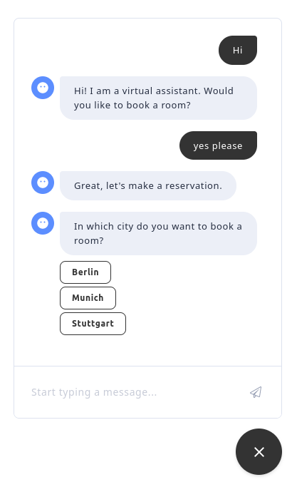

# Chatbot to Book a Hotel Room

Chatbot to book a hotel room developed with [Rasa Open Source](https://rasa.com/docs/rasa/). The chatbot uses modern NLP for intent detection and traditional parsing techniques to extract numbers, dates and email adresses.



## How to train the NLP model.
To train the model, just run the following command:

```
./retrain_model.sh
```

## How to run the chatbot locally
Provided that the NLP model has been trained, you can run the chatbot by executing the following command:

```
docker compose up
```

The webserver will start and the the Rasa Application will load the NLP model. Additionally, the Rasa Action Server will start. 
You can now interact with the chatbot using the website at [port 8080 of localhost](http://localhost:8080/).
To restart the chat, just reload the page.

